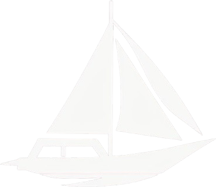

# YAWL - Yet Another Wonderful Language

<p align="center">
  
</p>

[](https://github.com/codersauce/yawl/actions)
[](https://opensource.org/licenses/MIT)

YAWL is a Rust project with the ambition to become a CA-Clipper language compiler. This project showcases the learning experience of reimplementing the old compiler for the classic CA-Clipper language. It features a comprehensive pipeline including lexical analysis, parsing, intermediate representation (IR) generation, and assembly code production.

**Note:** This project is currently in active development and may undergo significant changes. It is part of the YouTube series [_Rust Compiler for CA-Clipper_](https://www.youtube.com/playlist?list=PL9KpW-9Hl_hdAeo4tx_Td1aTJ7dzT_fx4), which documents the journey of building this compiler from scratch.

## Project Structure

The project is organized into two main components:

1. `core`: The heart of the compiler implementation
2. `stdlib`: A growing standard library for the language

### Core

The core component is composed of the following crucial modules:

- `lexer.rs`: Performs lexical analysis, breaking down the source code into tokens
- `parser.rs`: Constructs an Abstract Syntax Tree (AST) from the token stream
- `ir.rs`: Generates an Intermediate Representation (IR) from the AST
- `assembler.rs`: Transforms the IR into x86-64 assembly code
- `main.rs`: Serves as the entry point, orchestrating the entire compilation process

## Dependencies

To build and run this project, you'll need:

1. Rust and Cargo (latest stable version recommended)
2. GCC (GNU Compiler Collection)

GCC is used in the final step of the compilation process to assemble and link the generated assembly code into an executable.

## Building the Project

To build the project, execute the following command in the project root:

```
cargo build
```

This command builds both the core compiler and the standard library.

## Usage

To compile a YAWL source file, use:

```
cargo run -- <source_file>
```

Replace `<source_file>` with the path to your YAWL source file.

The compiler will display the tokens, AST, IR, and assembly code for the input program. It then uses GCC to compile the assembly into an executable.

## Current Limitations and Future Plans

Currently, YAWL generates x86-64 assembly and is therefore limited to x86-64 processors. However, there are plans to expand support to ARM processors, particularly to enable macOS support on Apple Silicon machines.

## Language Features

At present, YAWL supports:

- Integer literals
- Variable assignment
- Function calls
- Basic arithmetic operations (implemented through function calls)

## Example

Here's a simple example of YAWL code:

```
result := add(5, 3)
print(result)
```

## Roadmap

- Implement additional language features (e.g., control flow structures, expanded type system)
- Introduce optimizations in IR and assembly generation
- Extend the standard library with more utility functions
- Enhance error handling and reporting
- Add support for ARM processors

## Contributing

We welcome contributions to the YAWL project! Feel free to submit a Pull Request or open an Issue for discussion.

## License

This project is licensed under the MIT License.
